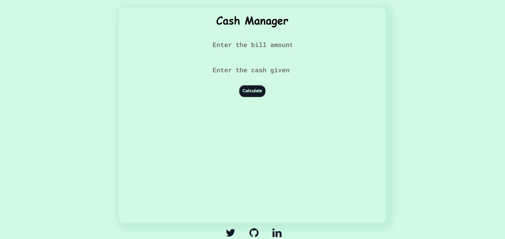

# CASH MANAGER
Cash Manager is the app that calculate balance amount between cash given and bill amount. On balance amount it shows how much notes or coin to be given back from the following notes and coin.
- [1, 5, 10, 20, 100, 500, 2000]

## Technology 
- ### Javascript
- ### CSS
- ### HTML

## About app
It takes the two input 
- 1) Bill amount
- 2) Cash Given
It takes the difference between cash given and bill amount. According to balance it shows notes or coin given back to customer.

[Cash Manager]()

## Connect Me
- [Twitter](https://www.twitter.com/virendra_wadher)
- [GitHub](https://www.github.com/virendrawadher)
- [LinkedIn](https://www.linkedin.com/in/virendra-wadher-042741155/)